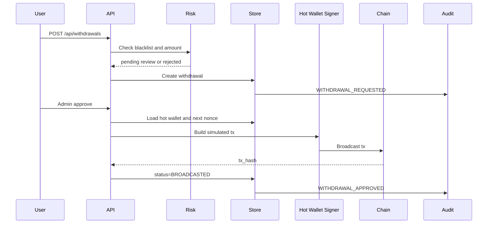

# 第三阶段：面试资产

## 项目一句话

我做了一个 Web3 钱包后台核心业务模拟系统，覆盖交易所钱包里最关键的充值、提现、审核、风控、nonce、冷热钱包、归集、链上状态和审计监控流程。

## 项目亮点

- 不是单表 CRUD，而是围绕钱包业务状态机设计服务。
- 提现链路包含黑名单、额度风控、人工审核、nonce 分配、链上交易状态流转。
- 充值链路保留链扫描器常见状态：看到交易、确认、入账。
- 将热钱包和冷钱包作为独立模型，为归集、余额水位、签名权限隔离留接口。
- 审计日志贯穿用户、地址、充值、提现、广播、确认，体现资产系统可追溯性。
- Prometheus 指标按生产监控思路设计，方便扩展告警。

## 调用链路图

## 面试官追问与回答

### 为什么提现要有人工审核？

链上转账不可逆，钱包系统不能只依赖用户请求直接签名。人工审核用于覆盖大额、异常地址、新设备、新用户、KYT 命中等规则。生产里会把规则分层：低风险自动放行，中风险人工审核，高风险直接拒绝。

### nonce 为什么要单独管理？

以 EVM 为例，同一个发送地址的 nonce 必须严格递增。如果多个提现并发从同一个热钱包发出，没有统一 nonce 管理就会出现 nonce 冲突、交易覆盖、卡 pending。生产中通常用 Redis 锁、数据库行锁或专门的 nonce service，并处理广播失败、加速、重放和链上 nonce 对齐。

### 为什么要区分热钱包和冷钱包？

热钱包用于日常自动出款，在线风险更高，所以余额应该有限；冷钱包离线或高权限保存大部分资产。归集任务负责把热钱包或用户充值地址里的资金汇总到冷钱包或资金池，控制暴露面。

### 充值为什么不能看到 tx 就立刻入账？

不同链有重组和确认风险。BTC、EVM、TRON 的确认策略不同，交易所通常按资产和链设置确认数，只有达到确认阈值才给用户记账。还要处理重复扫描、链重组、同 tx 多输出等问题。

### 这个项目离生产还差什么？

主要差四类：持久化和幂等、真实链节点适配、异步任务体系、安全签名体系。下一步会引入 PostgreSQL、Redis、队列、链适配器接口、KMS/MPC/TSS 签名边界、完整 Prometheus 指标和 OpenTelemetry tracing。

## 简历 bullet

- 设计并实现 Web3 托管钱包后台模拟系统，覆盖用户地址、充值入账、提现审核、黑名单风控、nonce 管理、冷热钱包归集、链上交易状态和审计日志。
- 基于 Go 构建分层后端服务，使用领域模型和状态机表达充值/提现核心流程，并提供 REST API、Prometheus 指标和自动化测试。
- 针对钱包系统高风险场景设计可扩展方案，包括地址黑名单、大额人工审核、热钱包余额水位、nonce 并发控制和链上确认状态同步。

## 技术博客大纲

题目：从零设计一个交易所钱包后台：充值、提现、风控与 nonce 管理

1. 钱包后台和普通支付系统的区别
2. 充值链路：地址分配、链扫描、确认数、入账
3. 提现链路：申请、风控、审核、签名、广播、确认
4. nonce 并发问题和工程解法
5. 热钱包/冷钱包/归集的资金安全模型
6. 审计日志和 Prometheus 指标如何设计
7. 从 MVP 到生产级系统的升级路线
