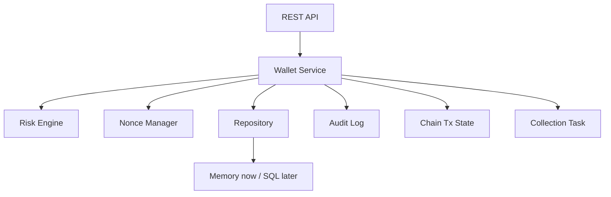
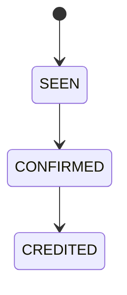
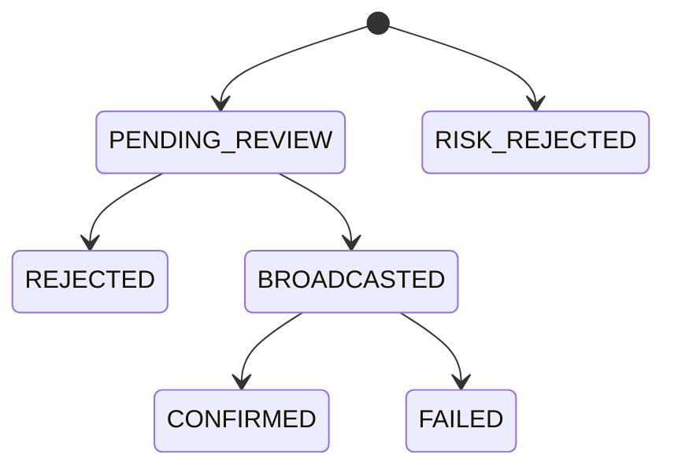
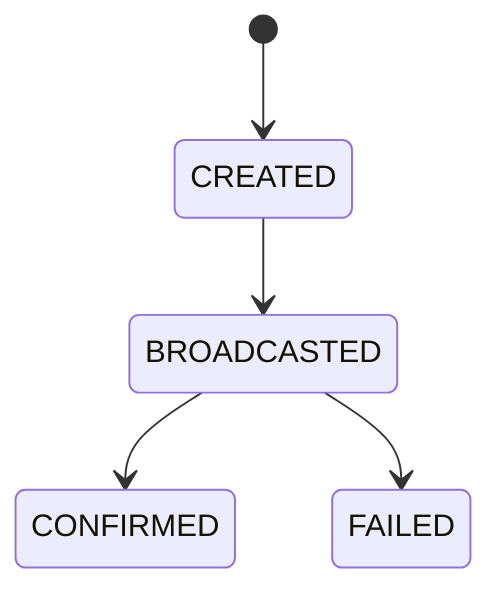

# 第一阶段：项目设计

## 业务背景

Web3 钱包后台不是单纯保存地址和交易哈希，而是要在“用户资产安全”和“链上不可逆交易”之间做工程控制。真实交易所/托管钱包常见链路包括：地址分配、链上充值扫描、确认数入账、提现风控、人工审核、热钱包签名、nonce 管理、广播确认、冷热钱包归集、审计和监控。

本项目模拟这些关键业务，用可运行状态机、资金不变量和恢复断言验证钱包系统的风险边界与后端工程落点。

## 技术架构

- 语言：Go
- HTTP：标准库 `net/http`
- 存储：当前内存实现，后续替换 SQLite/PostgreSQL
- 缓存/锁：当前 mutex 模拟，后续 Redis 实现 nonce 锁、幂等锁、风控缓存
- 指标：Prometheus text format
- 测试：Go `testing` + `httptest`

## 数据模型

- `User`：用户账户
- `Address`：用户多链充值地址，绑定 chain 和 wallet type
- `Wallet`：平台热钱包/冷钱包
- `Deposit`：充值记录，包含确认数和入账状态
- `Withdrawal`：提现申请，包含审核、风控、nonce、链上交易引用
- `BlacklistEntry`：黑名单地址
- `ChainTx`：链上交易状态机
- `CollectionTask`：热钱包到冷钱包归集任务
- `AuditLog`：关键业务操作审计

## 状态机设计

### 充值

当前 MVP 将充值模拟直接落到 `CREDITED`，但保留 `SEEN`、`CONFIRMED` 状态，方便后续接入链扫描器。

### 提现

提现审核通过后分配 nonce、生成链上交易、进入 `BROADCASTED`。链扫描确认后更新为 `CONFIRMED`。

### 链上交易

## 风控规则设计

MVP 已实现：

- 黑名单地址：直接 `RISK_REJECTED`
- 非正金额：直接拒绝
- 超硬限额：直接拒绝
- 大额提现：进入人工审核并附带原因

生产可升级：

- 24h 累计额度
- 新用户冷却期
- 地址首次提现延迟
- 行为频率风控
- Travel Rule/KYT 服务接入
- 多签或双人复核
- 风险命中事件入队异步处理

## Nonce 管理

当前通过内存 map 按 `chain:from_address` 单调递增。真实系统应改为：

- Redis 分布式锁或数据库行锁
- pending nonce 和链上 nonce 对齐
- 交易替换/加速策略
- 广播失败后的 nonce 回收或重试策略

## Prometheus 指标

- `wallet_withdrawals_total`
- `wallet_deposits_total`
- `wallet_audit_logs_total`

生产应补充：

- 提现状态分布
- 风控拒绝原因分布
- nonce 分配失败率
- 链节点 RPC 延迟和错误率
- 充值确认耗时
- 热钱包余额水位
